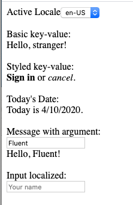
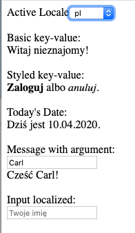

# fluent-web

A web component that uses [Project Fluent](https://projectfluent.org/) for localization. [Interactive example](https://wolfadex.github.io/fluent-web/) and the source code for the example is [here](./src).

| Locale en-US                                            | Locale pl                                         |
| ------------------------------------------------------- | ------------------------------------------------- |
|  |  |

Example usage:

JavaScript is just one way to make messages

```js
import flt from "@fleunt/dedent";

const messages = [
  "en-US",
  flt`
  hello = Hello, Fluent!
  `,
];
```

HTML:

```html
<fluent-web messages="messages" messageId="hello"></fluent-web>
```

Result:

```
Hello, Fluent!
```

For how to build messages, see the [Fluent docs](https://github.com/projectfluent/fluent/wiki).

### **_Note:_** No npm package is published yet so feel free to clone this repo or the clone `src/index.js` until then.

⚠️ WARNING ⚠️ This project is still in development and APIs are subject to change.

See the [Docs](./docs) for more details.
